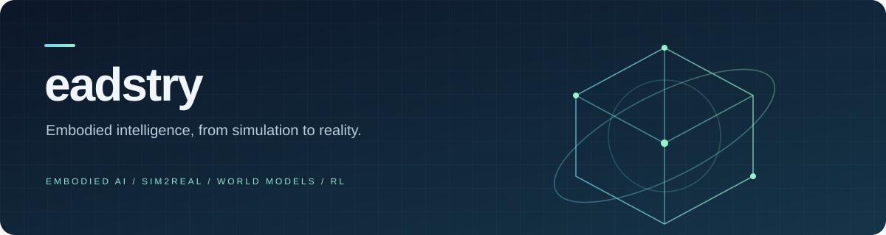

  

  <b>Embodied AI · Sim2Real · World Models · Reinforcement Learning</b> 
  具身智能 · 仿真到现实 · 世界模型 · 强化学习

  <a href="https://github.com/eadstry/geosic">GeoSIC</a> &nbsp; / &nbsp;
  <a href="https://github.com/eadstry/world-model-notes">World Model Notes</a> &nbsp; / &nbsp;
  <a href="https://github.com/eadstry?tab=repositories">Repositories</a>

 

### Hi, I'm eadstry

My research interests focus on **embodied AI, Sim2Real, world models, and reinforcement learning** — exploring how agents learn, understand, and act in the physical world.

研究兴趣聚焦具身智能，关注仿真到现实的迁移、世界建模，以及通过强化学习获得决策与控制能力。

### Selected work

<table>
<tr>
<td width="50%" valign="top">

#### [GeoSIC](https://github.com/eadstry/geosic)

Research code for **multi-view image compression**, with a PyTorch Lightning training pipeline and Hydra configuration.

Python · PyTorch Lightning · Hydra

</td>
<td width="50%" valign="top">

#### [World Model Notes](https://github.com/eadstry/world-model-notes)

A collection of **world-model reading resources**, with paper lists and documentation to explore the field.

World Models · Papers · Reading Resources

</td>
</tr>
</table>

### Exploring

- **Embodied AI** — connecting perception, decision-making, and action.
- **Sim2Real** — transferring skills learned in simulation to the real world.
- **World models** — learning representations of environments and their dynamics.
- **Reinforcement learning** — learning decision-making and control through interaction.

---

Perceive → Learn → Act

