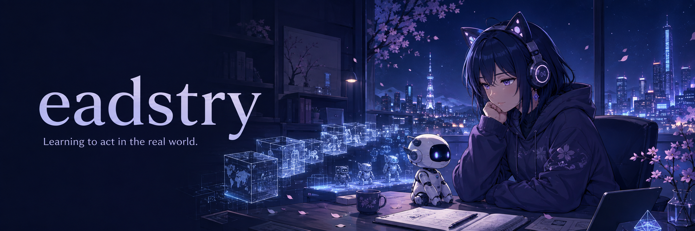

  

✦ &nbsp; PERCEIVE &nbsp; · &nbsp; LEARN &nbsp; · &nbsp; ACT &nbsp; ✦

<h2 align="center">Hi, I'm eadstry ✧</h2>

  Exploring how agents understand the world — and learn to act in it. 
  让智能体理解世界，也学会在世界中行动。

 

### 🪐 Research · 当前研究

**Embodied AI · Sim2Real · World Models · Reinforcement Learning**

研究兴趣聚焦**具身智能、仿真到现实、世界模型与强化学习**。关注智能体如何通过交互学习感知、决策与控制，以及如何将仿真中学到的能力迁移到真实世界。

> From learning in simulated worlds to acting in the real one.

 

### 📡 Previously · 过往经历

过去从事过**压缩编码与通信**相关工作，包括多视图图像压缩。

Previous work in compression coding and communications, including multi-view image compression.

 

✧ &nbsp; 小小的好奇心，通往更大的世界。 &nbsp; ✧

