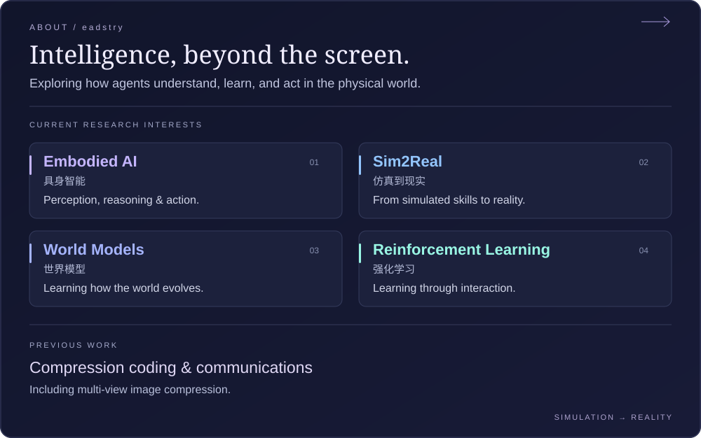

  

  

About me · 文字版

### 当前研究

我的研究兴趣是**具身智能、Sim2Real、世界模型与强化学习**，关注智能体如何理解环境、通过交互学习，以及将仿真中的能力迁移到真实世界。

- **Embodied AI** — 感知、推理与行动。
- **Sim2Real** — 从仿真中学习，向现实迁移。
- **World Models** — 学习环境表示与动态变化。
- **Reinforcement Learning** — 通过交互学习决策与控制。

### 过往经历

过去从事过**压缩编码与通信**相关工作，包括多视图图像压缩。

